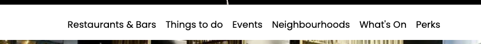
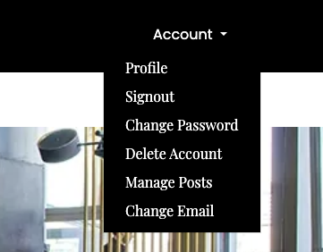
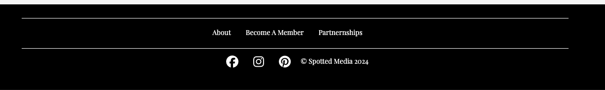
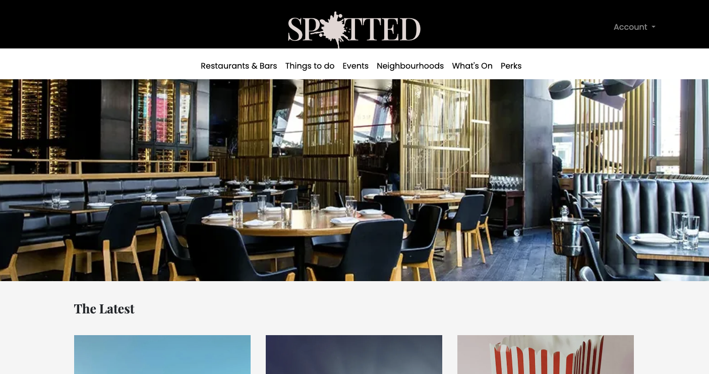
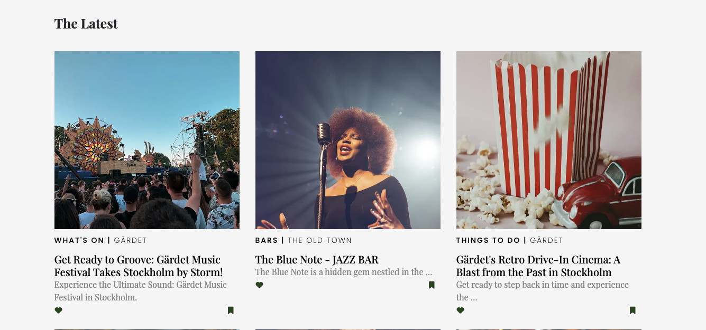
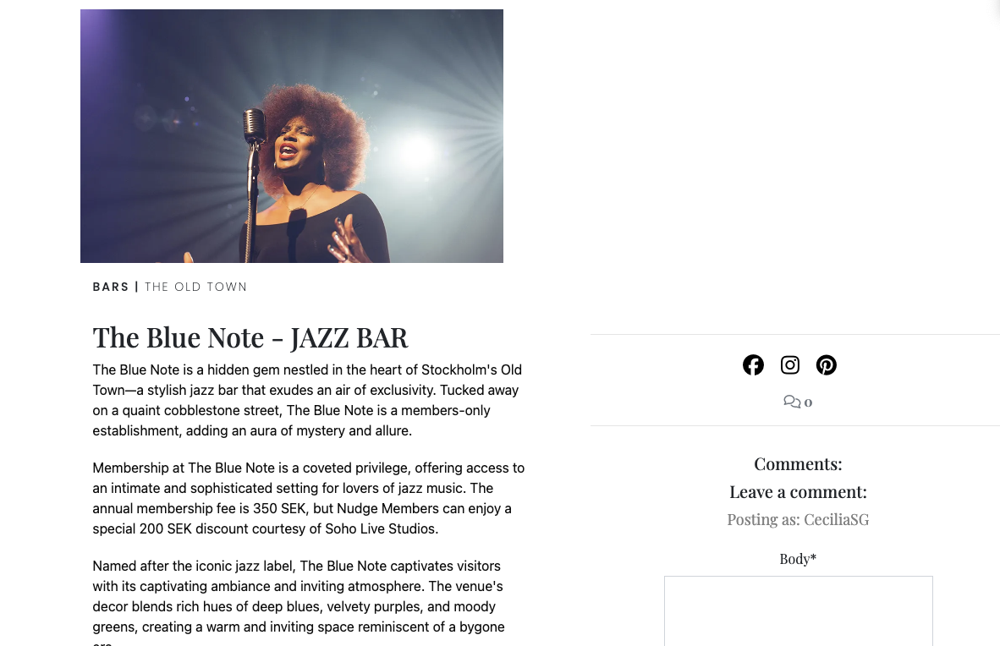
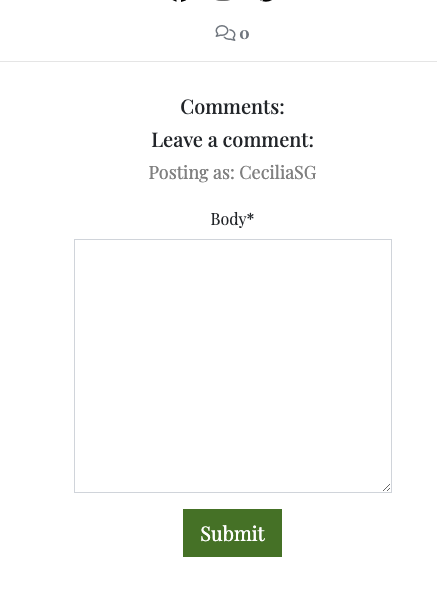
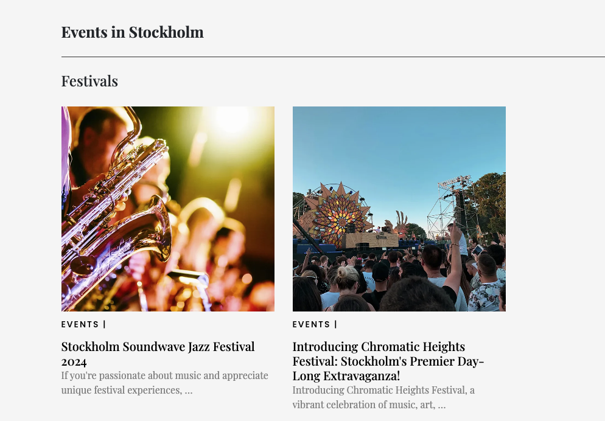
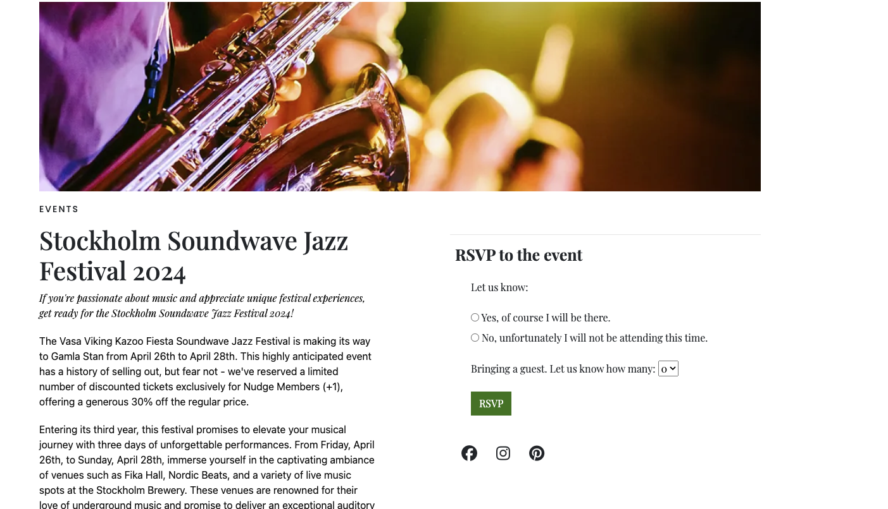

<h1 align="center">Spotted City Guide Membership Club</h1>

[View the live project here.](https://members-only-city-guide-cbef1c818fc1.herokuapp.com/)

<h2 align="center"></h2>


# Spotted members city guide

An insider membership guide to Stockholm.
This is a memberships site with the purpose of prividing members - people living in Stockholm - with a comprehensive guide of everything going on in the city as well as some perks for members making it good value for money. The site intends to includs everything from bars and restaurants, to things to do, events, musical festivals etc.


## User Experience (UX)

 ### User stories

 - **Kanban Board**
 

See testing against user stories further down under features!

 ### Testing User Stories from User Experience (UX) Section

#### First Time Visitor Goals

    1. As a First Time Visitor (non-logged-in), I want to easily understand the main purpose of the site and learn more about the benefits.

        1. Upon entering the site, users are greeted with a clean and easily readable navigation bar and a section briefly explaining what the site is about and the possibility of trying a membership for for free by clicking the button, or follow a link to read more.
        2. A non logged-in user can have a look around, see the posts with the excerpts, click the nav-links to the other pages, but not click the post links. The non-logged in user has the option to sign-up or read more about the membership.
        3. There is also a seperate navbar for logging in and signing up. This navbar drops down on smaller screens.

    2. As a First Time Visitor and returning visitor (logged-in), I want to be able to easily be able to navigate throughout the site to find content and administrating my account.

        1. The site has been designed to be fluid and has a content navbar at the top of every page, to never to entrap the user. At the top of each page there is a clean navigation bar with links to each content page, the links are cleary and simly described so uers know whre it will take them.
        2. On the Contact Us Page, after a form response is submitted, the page refreshes and the user is brought to the top of the page where the navigation bar is.
        3. As a logged in user I can access the first navbar, a dropdown here I can access my profile (where I also find my saved post). Via this dropdown-navbar I can also access the pages for changing my email, password, logout and deleting my account.

   
-   #### Returning Visitor Goals

    1. As a Returning Visitor I want to see what new posts and events have been added to the site.
        1. These can be found in the first section on the index-page in the section The Latest.
        2. The Latest section is clearly visible on the first page.

    2. As a First time and Returning Visitor, I want to find out more about which events are coming-up and I want to be able to RSVP to the event.

        1. The events link is crealy visible in the navbar.
        2. On the event-detail page the uer can read more about the event and when and where it is taking place.
        3. The event-detail page also includes a form to let the user RSVP to the event.

    3. As a Returning Visitor, I want to find the links to the site social pages so that I can join and get the latest updates.
        1. The Some me pages can be found in the footer (visible on every page), as well as in the right hand column on the details pages.
     

-   #### Frequent User Goals

    1. As a Frequent User, I want to se what is going on in the city, maybee make plans for the weekend.

        1. The user would already be comfortable with the website layout and can easily click the banner message.

    2. As a Frequent User, I want to check to see if there are any new posts for restauarants, bars etc.

        1. The user, who is a member will now know where to find everything and can easily navigate the site.
        1. At the bottom of every page their is a footer which is the same on every page, just as the navigation.


-   ### Design
    -   #### Colour Scheme
        -   The three main colours used are black, white and green.

    -   #### Typography
        -   The Playfair Display font is the main font, together with Poppins used throughout the whole website with Serif and Sans Serif as the fallback fonts in case for any reason the font isn't being imported into the site correctly. 

    -   #### Imagery
        -   Imagery makes an internet site more interesting. The large, top images on every page for logged in users are chosen designed to add a vibrant feeling to the page. The post and events images are also choosen to give the site a vibrant, fun and energetic feeling.

*   ### Wireframes

    -   Page Wireframe - [View](resources_readme/1.jpg)
                       - [View](resources_readme/2.jpg)
                       - [View](resources_readme/3.jpg)

*   ### ERDS for models

#### ERD Post model
| FK | Heading | Heading Model|
| ----------- | ----------- | ----------- |
| | title | charfield |
| | image |CloudinaryField |
| | Content | textField  |
| | slug | slugfield |
| | excerpt | textField  |
| | tag| charfield  |
| | status | small Integerfield |
| | start date |  |
| | end date|  |
| | Neighbourhood| TextField  |

<br>

#### ERD Event model
| FK | Heading | Heading Model|
| ----------- | ----------- | ----------- |
| | title | charfield |
| | image |img  |
| | description | text  |
| | slug | slugfield |
| | excerpt | text  |
| | tag| charfield  |
| | status | small Integerfield |
| | start date |  |
| | end date|  |

<br>

#### ERD Saved Post Model
| FK | User| User Model|
| ----------- | ----------- | ----------- |
|FK | Post | Post Model |
| | created_at |  |

<br>

#### ERD Liked Post Model
| FK | User| User Model|
| ----------- | ----------- | ----------- |
|FK | Post | Post Model |
| | created_at |  |
| | button-colour | charField  |

<br>

#### ERD RSVP Model
| FK | Event | Event Model|
| ----------- | ----------- | ----------- |
| FK | User| User Model|
| | Response  |CharField |
| | num_guests |Charfield |

<br>

#### ERD UserProfile Model
| FK | User | User Model| OntoOneField |
| ----------- | ----------- | ----------- | ----------- | 
| | Neighbourhood | CharField |
| | Interests |ArrayField |
| | City | Charfield  |

<br>

#### ERD Heading model (both event and post) ####
| FK | parent-heading | User Model|
| ----------- | ----------- | ----------- | 
| | Name | CharField |
| | created_at ||
| | updated_at |   |

*Note! This model hasn't been used as extensively as intedend when created and should be implemented and developed further.

## Technologies Used

### Languages Used

-   [HTML5](https://en.wikipedia.org/wiki/HTML5)
-   [CSS3](https://en.wikipedia.org/wiki/Cascading_Style_Sheets)
-   [Bootstrap](https://en.wikipedia.org/wiki/Bootstrap_(front-end_framework))
-   [Django](https://en.wikipedia.org/wiki/Django)
-   [Javascript](https://en.wikipedia.org/wiki/JavaScript)


### Frameworks, Libraries & Programs Used

1. [Bootstrap 5:](https://getbootstrap.com/docs/4.4/getting-started/introduction/)
    - Bootstrap was used to assist with the responsiveness and styling of the website.
2. [Google Fonts:](https://fonts.google.com/)
    - Google fonts were used to import the 'Titillium Web' font into the style.css file which is used on all pages throughout the project.
3. [Font Awesome:](https://fontawesome.com/)
    - Font Awesome was used on all pages throughout the website to add icons for aesthetic and UX purposes.
4. [jQuery:](https://jquery.com/)
    - jQuery came with Bootstrap to make the navbar responsive but was also used for the smooth scroll function in JavaScript.
5. [Git](https://git-scm.com/)
    - Git was used for version control by utilizing the Gitpod terminal to commit to Git and Push to GitPod.
6. [GitHub:](https://github.com/)
    - GitHub is used to store the projects code after being pushed from Git.
7. [Photoshop:](https://www.adobe.com/ie/products/photoshop.html)
    - Photoshop was used to create the logo.
7. [Canva:](https://canva.com/)
    - Canva was used to create the [wireframes](https://github.com/) during the design process and [ERD-Tables](https://github.com/)
9. [Tiny PNG](https://tinypng.com/)
- Tiny PNG was used to compress the images
10. [cloudconvert][https://cloudconvert.com/jpg-to-webp]
- Cloudconvert was used to convert the images to webp.
11. [cloudinary]
- Cloudinary was used to serve the event and post images uploaded via the admin panel.


## Features 

-   Responsive on all device sizes

-   Interactive elements

## TESTING

### 1. Manual Testing

## Features visible on all pages of the site

- __Navigation Bars: First Navbar and Second Navbar__

  - Featured on all pages, the full responsive navigation bar includes links to the Logo (which is also a linked to the homepage), Restaurants & Bars, Things To Do, What's On, Events, Neighborhoods, Perks and Sign-in and Sign-Up (when logged out) and a dropdown with profile, logout, change password and change email when logged in. The navbar page and is identical on each page to allow for easy navigation.
  - This section will allow the user (logged-in and non-authenticated) to easily navigate from page to page across all devices without having to revert to the previous page via the ‘back’ button. 

  - The featured logo works as the link to the home/landing page.

### Testing First navbar and logo-link:
**Expected:** The links are expected to take the user to the declared page/feature when the user clicks the link.

**Testing:** Tested the links by clicking them.

**Result:** The links link to the correct pages/endpoints when clicked. The logo works as a link back to the home-page.

### Testing first navbar for logged-out users. Links to sign-in and sign-up:
**Expected:** The links are expected to take the user to the declared page/feature when the user clicks the link.

**Testing:** Tested the links by clicking them.

**Result:** The links link to the correct pages/endpoints when clicked.


### Testing second navbar/Account for logged-in users. Links to profile, sign-out, change password, change email, delete account, manage posts (only visible to staff-authenticated users):

**Expected:**

- The links are expected to take the user to the declared page/feature when the user clicks the link. 

- The Manage Posts link is expected to only show when the logged-in user is staff.

**Testing:** Tested by logging in as non-staff member and staff member. Tested the links by clicking them.

**Result:** The links link to the correct pages/endpoints when clicked. The link in to manage posts in the accounts navbar is only visible when a logged in user is authenticated as staff.


<br>



<br>



<br>


### Testing the Footer

-	Featured on all pages and visible for both logged-out and logged in users.
-	Includes links to pages: About, Become a member and Partnerships.
-	Includes SOME-links to FB, LinkedIn and Pinterest.

<br>

**Expected:** The links are expected to take the user to the declared destination when the user clicks the link.

**Testing:** Tested the links by clicking them.

**Result:** The links link to the correct pages/endpoints/SOME-pages when clicked.


</br>


## Pages including all features, links etc. in these.

### Landing page (index.html)

  - The landing page give the users an overview of the site. Posts are only clickable for logged in users. 

  - “The Latest” section show the users the latest from all categories/pages: restaurants & bars, things to do, what's on etc.

<br>

-	#### For logged-out users/non-members:

-	When a non-logged in user first enter the site, a modal is shown prompting them to login or sign-up (if they are not already members) to get access to all content. 

**Testing Modal:**
-	**Expected:** The modal loads when the page is reloaded.

-	**Testing:** Tested by reloading the page in logged-out mode (and logged in mode). The buttons in the modal were clicked. 

-	**Result:** The modal shows for non-logged in users, with two clickable buttons. The buttons take the user to sign-in and sign-up pages/forms.
-	Posts are visible to non-logged in users but can’t be clicked.

-	Top banner with brief explanation of sites purpose, includes button to sign-up page. Only visible in logged out mode.

**Testing Try Spotted for free button:**
-	Expected: The button takes the user to the sign-up page.

-	Testing: Tested the button by clicking it.

-	Result: The button takes the user to the sign-up page/form.


**For logged-in users/non-members:**

-	The page displays a hero image for logged in users. All content is accessible. Logged in users can also save posts to their profile by clicking the save post symbol, so that they can come back to them later. There is also a feature to like the post for logged in users.

**Testing post-links, save post feature and liking feature:**
- **Expected:**
- The links take the users to the correct post-details page.
- By clicking the save post symbol the post gets saved and shows in the user’s profile. The user is informed that the post has been saved through an alert message. The reverse is true for un-saving the post.
- By clicking the heart beneath the post, the user likes the post, and this information is stored. The user is informed that they’ve liked the post via an alert message. The heart turns read to indicate that the post has been liked (at the moment the colour is only saved in the session and disappears if the page is reloaded and is not visible when the user comes back to the page. If the user likes a post that they have already liked the alert message shows and informs them of this. Posts can be unliked by clicking the heart again.


- **Testing:**
- Post-links were clicked.
- Save symbol was clicked to save and clicked again to un-save.
- The heart symbol was clicked to like and clicked again to un-like the post.

- **Result:**
- The links take the user to the correct post-details page.
- Posts are saved to the profile and the alert appears. Posts are unsaved when clicked a second time. The user is informed through the alert message. The post is removed from the profile.
- The heart symbol turns red when a user likes a post. The alert message appears informing them they’ve liked the post. When symbol is clicked again the colour reverts to green and a message appear informing the user they’ve unliked the post. The red colour of the heart is only saved in the session.



<br>

### Testing post pages: Restaurants & Bars, What's On, & Things to do etc.__

  - These pages have the same layout, structure and function - they display posts for the relevant subjects and allow user to brows restaurants, bars, things to do essentially things that are happening in the city. Posts are added daily to give the members/users value and incentive to keep being members.

<br>

## Post pages: ##
### Post List page

<br>


<br>

- __Neighbourhoods Page__

  - The Neighbourhoods page displays by neighbourhood, to make it easier for users to find what is going on around where they live or work.

<br>

- __Perks Page__

  - This displays a post list of the perks available to members.

</br>


### The Post details page
- Includes an informative text, clickable SOME-symbols and a comments feature to comment the post.

**Testing SOME-symbols on details page:**
**Expected:** The SOME-symbols are clickable and take the user to the correct some endpoint.
**Testing:** The SOME-symbols were clicked.
**Result:** The user is taken to correct endpoints when SOME-symbols are clicked.

<br>



<br>

#### Testing the comments function:
**Expected:** When a user comments the comment should be shown as awaiting approval. The buttons edit and delete underneath the comment should be clickable to let the user use these functions. The comment should be visible in the comments section in the admin so it can be approved. When approved the buttons should turn green. Users should be able to see other users’ approved comments, but only be able to edit and delete their own. The comments count function displays the number of comments for the post. After editing the comment needs new approval. When delete is clicked a modal should appear asking the user if they are sure they want to delete the comment. When the delete button in the modal is clicked the comment should be removed and no longer be visible.

**Testing:** A comment was created, submitted and then approved from the admin. The user logged out and another user logged in to see the approved comment. The edit function was tested by clicking the button, editing the comment and clicking update. The delete function was tested by clicking delete.

**Result:** The user’s comment was created, shown and the lit up when approved. The user can see, edit and delete their own comments. Other users’ comments are also visible to them. The comment count function displays the number of comments for the post. When edit is clicked the comment appears back in the comments function and can be edited and then needs new approval from the admin. When delete was clicked the modal appears and gives the user the choice to delete or close the modal. The close button closes the modal. When the modal delete-button is clicked the comment is removed and is no longer visible. The comment count is updated accordingly.




### Testing the Events page

  - The Events page give the user an overview of the events available and will allow the user to see the benefits of signing up as a member.
  - The listed events are clickable only for logged-in users (logged-out users can only see the post-list but the links are not available) and takes the user to a details page with more information about the event. 

-	**Expected:** The post-link takes the users to the correct events detail page.

-	**Testing:** Tested by clicking the links.

-	**Result:** The links take the user to the expected events details page.




### Testing the Events Detail page

- The events details page includes more detailed information about the event and includes a feature for members (logged-in users) to RSVP to events and let the arrangers know how many guests they will be bringing.

  <br>

| Form | Description | Expected | Comment | Testing | Result |
| ----------- | ----------- | ----------- | ----------- | ----------- | ----------- |
| **RSVP-form**, App: rsvp, Template: event_detail.html| Gives the user the ability to RSVP for posted events. <br> The RSVP-form is part of the event detail page. The user can choose yes or no <br> and the number of guests <br> and then click the RSVP button. | When the user choses yes or no and choses a number of guest (optional) and clicks the RSVP-button they a message thanking them for their RSVP should appear on the screen. They should also be sent a confirmation email thanking them for their RSVP and letting them know which event they’ve RSVPed to and the number of guests they have signed-up. The RSVP-info is also expected to appear in the admin. | The user can change their response <br> by changing their answer and number of guests <br> and submitting again. | The radio buttons were clicked, and number of guests chosen. The RSVP button was then clicked to send the response. | The radio buttons function and so does the dropdown to select no. of guests. The user's response gets sent to the admin. The Message appears on the screen and the confirmation email gets sent to the users registered email address. |

<br>




**RSVP Form:**<br>


<br>


| Form | Description | Expected | Testing | Result |
| ----------- | ----------- |  ----------- |  ----------- |  ----------- |
| **Resend Verification**, Form App: Core, Template: resend_verfication.html | Lets the user request a new verification link sent to their email. Note! New verifications can be sent more than once but straight after each other. It seems there is a limit on how many emails can be sent to the same email address with a certain time span. | When an email is filled in and the re-send verification button is clicked an email should be sent with a new link. A message letting them know the email has been sent should be shown. If the email exists but is already registered a message should be shown informing the user of this. If the email doesn’t exist in the database a message should be shown informing the user of this. | An incorrect and a correct email were entered and the re-send verification button clicked. | When an email existing in the database was entered an email with a new verification link was sent. When the link in the email was clicked the email was verified and the user asked to login. When an already verified email was entered a message was displayed informing the user. When an email that doesn’t exist in the database a message is displayed informing the user of this.  |


| Form | Description | Expected | Testing | Result |
| ----------- | ----------- |  ----------- |  ----------- |  ----------- |
| **Password Reset**, Form App: AllAuth, Template: allauth/password reset | Lets the user reset their password. | When the user enters a registered password an email with a password reset link should be sent. When the link in the email is clicked, they should be redirected to the change password page. When a new password is entered (twice) and the change password button clicked the password should be reset, and the user redirected to a page informing them of the change. If a user enters a non-registered email an email is sent informing the user that their email isn’t in the database. In both cases the user should be directed to a page informing them an email was sent. | A registered and an unregistered email was entered and the reset my password button clicked. The link in the sent email was clicked and the change password form tested by providing a new password and clicking change password. The new password was tested by login in after the password change. | When a registered email is entered an email with reset link is sent and the user is directed to a page informing them of this. When the link is clicked it takes the user to the reset page, where the user can choose a new password and when they click “reset the password” ii is reset. When the user tries to login with their new password is logs them in. If the user enters an email not in the database, they are redirected to the page informing them an email has been sent. The email informs the user their email is not registered. |


### Testing the Profile Page

  - This page allows users to see their personal info. and profile choices, as well as their saved posts. It also allows them to update their information. The form is pre-populated the username, user email and their choice of city, neighbourhood, interests. The membership is presently only available in Stockholm, <br>why there is only one choice for city.

<br>

| Form | Description | Expected | Testing | Result | Fix |
| ----------- | ----------- | ----------- | ----------- | ----------- | ----------- |
| **UpdateUserProfileForm**, App: Core, Template: profile.html | Gives user the ability to change their details and preferences. <br>The user can update their profile <br> by changing and confirming <br> email and username. The form is pre-populated <br> with existing details. | The form is expected to render and show and pre-populate username and email which both have fields for conf. which must be filled out before updating. The user can also change <br> their neighbourhood and interest choices. <br>The email and username must match in both fields. <br> otherwise the form won’t update the information but will return the <br> form ask the user to correct the errors, that are marked. When the form is updated, a message is displayed letting the user know. | The form was filled in with incorrect and correct information and submitted by clicking update. | If the emails and/or username do not match the form is returned and the user is asked to correct the errors. If the fields are filled out correctly the profile is updated, a message lets the user know that it’s been updated, and the form displays the updated information. The user can update to an already existing email – which should not be possible. The modal covers the success message. | Change UserUpdateForm so to check for existing usernames and emails and returns an error if user tries to update to existing username or email. |

<br>


<br>


### Testing Signout function

 ***Signout link visible in the Account dropdown menu when signed in**

| Function | Description | Expected | Testing | Result | 
| ----------- | ----------- |  ----------- | ----------- | ----------- |
| **Signout**, App: Core, Template: logout.html | When the Signout link in the first/account navbar (dropdown) is clicked <br> it takes the user to the sign-out page. <br> | When the user clicks the sign-out button they should be signed out, a message should display informing them they’ve signed-out and redirected to the home page for non-logged in users. the <br> | Clicking the link in the navbar takes the user to the sign-out page where they are given the option to sign-out. When the sign-out button is clicked the user is signed out, as message is displayed, and they are redirected to the home page for non-logged in users. |

<br>


<br>


### Testing the Change Email function

  - Link visible in the Account dropdown menu when user is logged in. Registered users can change/update their email.

  <br>

| Form | Description | Expected | Testing | Result |
| ----------- | ----------- |  ----------- | ----------- | ----------- |
| **Change email**, AllAuth, email.html| The user can add an email and therefore technically changing it. They can also mark an email as primary as well as removing it. Users can also request a reverification if their email isn’t verified. More than one email can be associated with an account. | When a user enters an email in the field and clicks add email it should be added to the account. A verification email should be sent. By clicking the verification link in the email the email should be verified. When the user clicks remove email, it should be removed from the account. When the user clicks the radio-buttons next to the email address and then clicks make primary the email should be marked as primary for the account. A resend verification mail should only be sent if the one of the emails for the account isn’t verified. | When a user enters an email and clicks add email it is added to the account. A verification email is sent to the added email. When the verification link in the email is clicked the email displays as verified. The user can choose an email with the radio-buttons and then click make primary and it is made the primary email for the account. If the user clicks re-send verification for an unverified email an email is sent (doesn’t happen for already verified email addresses). When a user chooses an email with the radio-buttons and clicks remove the email is removed from the account.

<br>


<br>


### Testing the Change Password finction

  **Visible in the Account dropdown when user is logged in. Gives the user the ability to change their password. Registered users can change their password.**

 <br> 

| Form | Description | Expected | Testing | Result |
| ----------- | ----------- |  ----------- | ----------- | ----------- |
| **Change password**, AllAuth, password_change.html| Form for changing user password and recovering password if forgotten. | When the user enters their current password and then <br>chooses a new one, confirms it before clicking change password the password is reset. <br> When the user clicks the link forgot password, they should be redirected to the password reset page to enter their email and receive an email with a reset link. When the reset link is clicked, the user should be directed to the page where they can choose and confirm a new password. After clicking the change password button, they should be re-directed to a page with a conf. message. <br> | The current password was filled in, a new one chosen, confirmed and change password clicked. The new password was tested by trying to login. The Forgot password button was clicked and a registered email provided. The link in the password reset email was clicked a new password chosen and confirmed on the change password page. The password was tested by trying to login with the new password. | The password is changed when the current password is provided a new one chosen and confirmed. Login with the new password is successful. Providing the user email and requesting a password reset sends a reset email to the user. When the reset link is clicked it takes the user to the reset password page. Entering a new password and confirming it resets the password. A message is displayed informing the user. Login in with the new password is successful. |

<br>


<br>

### Testing the Delete Account function

  **Reachable from the Account drpdown when user is loggein. Gives the user the ability to easily delete their account. Registered users/members can delete their account and all associated information. Accessible from the Account dropdown menu.**

<br>  

| Form | Description | Expected | Testing | Result|
| ----------- | ----------- |  ----------- | ----------- | ----------- |
| **DeleteAccountForm**, App: Core, delete_account.html | Lets user delete their account and all associated information. <br> | When the link in the dropdown menu is clicked the user should be redirected to the delete account page. When thy check confirm account deletion and click delete account the account should be deleted and they should be logged out and redirected to the home page for logged out users. | The link in the dropdown was clicked. The confirm delete checkbox was checked and the delete button clicked. The feature was tested without checking the delete account confirm box. | The menu link takes the user to the delete account page. When the user checks the checkbox and clicks delete the account is deleted and the user is signed-out and returned to the home page for logged out users. All user info and any profile information <br> related to the user is deleted from the admin panel and the database. When the delete account confirm wasn’t checked the deletion isn’t possible – the user is then prompted to check the box if they want to continue. |


<br>


- __Manage Posts__

  - Gives authorised users/staff the ability to add, edit and delete posts from the frontend.

 <br> 

| Form | Description | Expected | Testing | Result | Fix |
| ----------- | ----------- |  ----------- | ----------- | ----------- | ----------- |
| **Manage Posts**, App: Content Management, post_form.html | Page and form for adding, editing and deleting posts from the frontend. | When the users fill in content, adds an image and clicks save the post should be saved. When the user clicks edit the post should appear in the form so that it can be edited and saved with any changes. When the user clicks delete a modal should appear asking the user “Are you sure you want to delete this post? This action cannot be undone.” If the user clicks delete in the modal the post should be deleted. | The add feature was tested by adding text content and an image and clicking save. The edit feature was tested by clicking edit next to a post, editing in the post form and clicking save. The delete function was tested by clicking delete next to a post and then clicking the delete button in the modal. | When content, image and unique title was added to the post form and saved the post was visible in the post list and could be viewed by clicking the link. But the image was only added randomly. When an attempt was made to save a post with an already existing title, there was an error due to the slug not being unique. When the edit link was clicked the post appeared in the form. The post was edited and saved successfully, including changing the image. When clicking the delete link the modal appears querying if the user wants to delete the post. When the delete button in the modal was clicked the post was deleted. | The post_add view was updated to handle the integrity error when a user tries to add a post with the same title as an existing post/slug. The view was also modified to guarantee that the image is added. |

Note! The comment form is visible on drafts. Comments can be added to drafts, but not deleted from the frontend.


### 2. Testing site responsivenes


### Existing Features and Testing against user stories


### 3. Lighthouse

#### Results:

<br>

Mobile, logged-out users:

<br>

 
 <br>

Desktop, logged-out users:

<br>


Mobile, logged-in users:

<br>

 

 <br>

Desktop, logged-in users:

<br>


### 4. Validator Testing. code validation testing css, html and JS

- HTML
  - Stray end tags were flagged for when checking code when non.logged in, this is because the some links are only available to authorized users, which means the link isn't visible when logged out. The link wraps a card so the end tag is visible to the browser. When checking the same html when logged in it passes validation. 

 -  Summernote is causing issues by rendering code inte white spaces on the details_templates (event_detail and post_detail). This throws errors when validating the HTML for these pages. The form on the event_details page also seems to be adding an end p end-tag which I can't find anywhere to remove. It seems to ahve to do with the Summernote content/description field. Unfortunately I've been unable to resolve the issue within the time frame of the project.

 <br>


<br>

-  No other errors were returned when passing through the official [W3C validator](https://validator.w3.org/)

- No errors were found when passing through the official (Jigsaw) validator [https://jigsaw.w3.org/]
- CI Python Linter [(https://pep8ci.herokuapp.com/)]
- JS Hint [(https://jshint.com/)] No error were found when passing the code through JSHint.

<br>

### Further Testing

-   The Website was tested on Google Chrome.
-   The website was viewed on a variety of devices such as Desktop, Laptop and iPhone
-   A large amount of testing was done to ensure that all pages were linking correctly.

<br>

### Features Left to Implement

- Navigation directly between posts without having to back out to the post_list.
- Navigation directly between events without having to back out to the event_list.
- At the moment the email feature only runs in the terminal, and email verification isn't required to sign up. Connecting the email and sending actual emails, and email verficatiosn is a feature that should be implemented.
- More filtering functions, and more tags. The content now added to the site is sample content and I would have wante to add more if time had allowed.
- Implementing a map pinpointing all recommendations, events, what's on etc.
- A search field in the navbar.
- Read more for the sections as the number of of posts and events will grow.
- Add more confirmation messages to make the user experience better i.e. after registering, signout, password change etc.
- More javascript should be used to give the site a smother experience.

<br>

### Unfixed Bugs

- See above for issues with Summernote.
- Not a bug as such, but images need better handling. Better handling hasn't been possible due to lack of knowledge and time. So this is something I would like to look into.

<br>

## Deployment

### GitHub Pages

The project was deployed to GitHub Pages using the following steps...

1. Log in to GitHub and locate the [GitHub Repository](https://github.com/)
2. At the top of the Repository (not top of page), locate the "Settings" Button on the menu.
    - Alternatively Click [Here](https://raw.githubusercontent.com/) for a GIF demonstrating the process starting from Step 2.
3. Scroll down the Settings page until you locate the "GitHub Pages" Section.
4. Under "Source", click the dropdown called "None" and select "Master Branch".
5. The page will automatically refresh.
6. Scroll back down through the page to locate the now published site [link](https://github.com) in the "GitHub Pages" section.

### Forking the GitHub Repository

By forking the GitHub Repository we make a copy of the original repository on our GitHub account to view and/or make changes without affecting the original repository by using the following steps...

1. Log in to GitHub and locate the [GitHub Repository](https://github.com/)
2. At the top of the Repository (not top of page) just above the "Settings" Button on the menu, locate the "Fork" Button.
3. You should now have a copy of the original repository in your GitHub account.

### Making a Local Clone

1. Log in to GitHub and locate the [GitHub Repository](https://github.com/)
2. Under the repository name, click "Clone or download".
3. To clone the repository using HTTPS, under "Clone with HTTPS", copy the link.
4. Open Git Bash
5. Change the current working directory to the location where you want the cloned directory to be made.
6. Type `git clone`, and then paste the URL you copied in Step 3.

```
git clone https://github.com/YOUR-USERNAME/YOUR-REPOSITORY
```

7. Press Enter. Your local clone will be created.

```
$ git clone https://github.com/YOUR-USERNAME/YOUR-REPOSITORY
> Cloning into `CI-Clone`...
> remote: Counting objects: 10, done.
> remote: Compressing objects: 100% (8/8), done.
> remove: Total 10 (delta 1), reused 10 (delta 1)
> Unpacking objects: 100% (10/10), done.
```

Click [Here](https://help.github.com/en/github/creating-cloning-and-archiving-repositories/cloning-a-repository#cloning-a-repository-to-github-desktop) to retrieve pictures for some of the buttons and more detailed explanations of the above process.

## Creating the Heroku app, deploying to Heroku

Steps to follow for deployment to Heroku:

### In GitHub.
1. Navigate to the repository for the project. 

### In Heroku

1.	Go to Heroku, create account, if you don't have one, and log in.
2.	Go to the dashboard and click New after which you click Create new app
3.	Choose name and region. Click Create app
4.	Go to Settings, under the "Config Vars" set your Key/Value Pairs.
    You must then create a _Config Var_ called `PORT`. Set this to `8000`
    If you have credentials, you must create another _Config Var_ called `CREDS` and paste the JSON into the value field.
    When you create the app, you will need to add two buildpacks from the _Settings_ tab. The ordering is as follows:
    1. `heroku/python`
    2. `heroku/nodejs`

5.	In the Buildpacks section, add buildpacks. Note order in which you add buildpacks: Python first and nodejs.
6.	No go to Deployment. In deployment method click on "GitHub"(for repository)
7.	The connect to GitHub, find your repository and click  connect.
8.	Under connect to GitHub-section, you can either chose automatic deploys with Enable Automatic Deploys or Manual Deploy, to deploy manually.
    
    **Now you can view the deployed app.**


## Credits 

- A great big thank you to my mentor and tutor support!

- I used the I Think Therefore I Blog walkthrough as a guide to get my project set up and get me started. And I refered back to it throughout the project.

- My mentor has also helped point me in the right direction when I've been lost, or had specific functions for the site in mind.

- I've used [Django](https://www.djangoproject.com/) documentation extensively to help me build models, views and forms etc.

- I've extensively searched [StackOverflow](https://stackoverflow.com/) for how to and solutions to things I've wanted to do in this project.

(https://stackoverflow.com/questions/739776/how-do-i-do-an-or-filter-in-a-django-query/739799#739799)

Class based views: https://ccbv.co.uk/
- How to extend the Django user model (and in general tips for Django):
[https://simpleisbetterthancomplex.com](https://simpleisbetterthancomplex.com/tutorial/2016/07/22/how-to-extend-django-user-model.html)
-  Creating a like function:
[StackOverflow](https://stackoverflow.com/search?q=creating+a+like+function+in+Django)
-- Liking/unliking posts without refreshing the page
[StackOverflow](https://stackoverflow.com/questions/63081738/like-unlike-a-post-without-refreshing-the-page)
- [StackOverflow](https://stackoverflow.com/questions/73250735/- why-does-my-like-button-return-a-json-object-liked-true-but-doesnt-work-wi)

- [StackOverflow](https://stackoverflow.com/questions/38370908/)(how-to-check-if-a-user-already-likes-a-blog-post-or-not-in-django)
(https://stackoverflow.com/questions/26230632/working-with-forms-in-django)
(https://stackoverflow.com/questions/66320330/)(django-how-to-pass-only-selected-arguments-through-url)
(https://stackoverflow.com/questions/42730992/django-queryset-filter-by-post-variable)
(https://stackoverflow.com/questions/56792640/)(how-to-display-all-titles-of-posts-related-to-a-post-using-tags)
(https://stackoverflow.com/questions/13076822/django-dynamically-filtering-with-q-objects)

- [Django](https://forum.djangoproject.com/t/multiple-choice-with-checkbox/14907)
https://stackoverflow.com/questions/62296423/how-to-use-q-to-filter-using-string
- Using Ajax with Django:
[StackOverflow](https://stackoverflow.com/questions/20306981/how-do-i-integrate-ajax-with-django-applications/20307569#20307569)
- Prevent default event:
[StackOverflow](https://stackoverflow.com/questions/7056669/how-to-prevent-default-event-handling-in-an-onclick-method)
- Let user delete their account:
[StackOverflow](https://stackoverflow.com/questions/54864355/django-user-account-delete-and-then-return-redirect-and-render)
(https://stackoverflow.com/questions/65510305/django-how-to-enable-users-to-delete-their-account)
(https://stackoverflow.com/questions/38047408/how-to-allow-user-to-delete-account-in-django-allauth)

- (https://stackoverflow.com/questions/62853713/how-filter-objects-in-django-views)
- [StackOverflow](https://stackoverflow.com/questions/16011434/using-foreach-method-in-javascript)
 - Setting up email allAuth:
 [https://florianbgt.com/](https://florianbgt.com/posts/django_allauth_email_login)
 - Summernote for frontend: 
 [StackOverflow - Summernote](https://stackoverflow.com/questions/60688640/summernote-using-django-forms-displaying-with-html-tags)
 [StackOverflow - Summernote](https://stackoverflow.com/questions/61657061/how-do-i-resize-the-width-of-summernote)


### Content 

- The text content for the posts and pages were generated with the help of AI.
- The icons used in the project were taken from [Font Awesome](https://fontawesome.com/)

### Media

- The logo and favicon was created by my husband.

- The images for posts, events and pages were downloaded from free images on [Unsplash](https://unsplash.com/)
